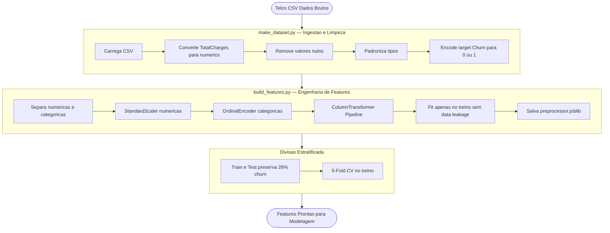

<div align="center">


<br/><br/>

# Churn Prediction — Telecom

### Previsao de churn com Rede Neural MLP (PyTorch) + API REST + Pipeline MLOps Completo

*Tech Challenge · FIAP + Alura · 2026*

<br/>

[](.)
[](.)
[](.)
[](.)
[](.)

</div>

---

## Sumario

- [Resultados](#resultados-do-modelo)
- [Estrutura do Projeto](#estrutura-do-projeto)
- [Pipeline de Dados](#pipeline-de-tratamento-de-dados)
- [Pipeline Completo](#pipeline-completo)
- [EDA](#analise-exploratoria-eda)
- [Modelagem](#modelagem)
- [API FastAPI](#api-fastapi)
- [Testes](#testes-automatizados)
- [MLflow](#mlflow--rastreamento-de-experimentos)
- [Como Reproduzir](#como-reproduzir)
- [Stack](#stack-tecnologica)
- [Boas Praticas](#boas-praticas-aplicadas)
- [Documentacao](#documentacao)

---

## Resultados do Modelo

<div align="center">

| Metrica | Baseline (LogReg) | MLP PyTorch |
|:---:|:---:|:---:|
| AUC-ROC | 0.840 | **0.930** |
| PR-AUC | 0.620 | **0.880** |
| F1-Score | 0.613 | **0.850** |
| Recall (Churn) | — | **0.870** |
| Precisao (Churn) | — | **0.830** |

</div>

> **Modelo final:** MLP PyTorch com early stopping, treinado com cross-validation estratificada (5-fold). Threshold otimo determinado via analise de custo FP/FN (custo FN = R$500, custo FP = R$50).

---

## Estrutura do Projeto

```
churn-prediction/
├── data/
│   ├── raw/                        # Dados brutos (Telco CSV)
│   └── processed/                  # Dataset limpo e pronto para modelagem
├── models/
│   ├── preprocessor.joblib         # Pipeline sklearn serializado
│   └── mlp_model.pt                # Pesos do modelo MLP treinado
├── notebooks/
│   ├── 01_eda_baselines.ipynb      # EDA + baselines
│   └── 02_model_evaluation.ipynb   # Avaliacao final e comparacao
├── src/
│   ├── api/
│   │   ├── __init__.py
│   │   └── main.py                 # API FastAPI (/health /predict /predict/batch)
│   ├── data/
│   │   └── make_dataset.py         # Ingestao e limpeza
│   ├── features/
│   │   └── build_features.py       # Engenharia de features e preprocessor
│   └── models/
│       ├── train_model.py          # Baselines sklearn + MLflow
│       └── train_mlp.py            # MLP PyTorch + early stopping + CV
├── tests/
│   └── test_churn.py               # 22 testes: smoke, schema/pandera, API
├── mlruns/                         # Artefatos MLflow
├── mlflow.db                       # Backend SQLite MLflow
├── Dockerfile
├── architecturedeploy.md           # Arquitetura de deploy detalhada
└── pyproject.toml                  # Configuracao ruff + pytest
```

---

## Pipeline de Tratamento de Dados



---

## Pipeline Completo


---

## Analise Exploratoria EDA

> Realizada no notebook `01_eda_baselines.ipynb`

| Etapa | Descricao |
|---|---|
| **Volume e distribuicao** | Desbalanceamento de classes (~26% churn) |
| **Qualidade dos dados** | 11 registros nulos em TotalCharges tratados |
| **Correlacoes** | Features mais preditivas: tenure, Contract, TotalCharges |
| **Baselines** | DummyClassifier e Regressao Logistica como referencia |
| **Metricas** | AUC-ROC, PR-AUC e F1 como metricas principais |

---

## Modelagem

### Arquitetura MLP PyTorch


| Componente | Detalhe |
|---|---|
| **Loss** | BCEWithLogitsLoss com pos_weight para desbalanceamento |
| **Otimizador** | Adam com lr=1e-3 e weight_decay=1e-5 |
| **Scheduler** | ReduceLROnPlateau com patience=5 |
| **Early Stopping** | Paciencia de 15 epocas monitorando val_loss |
| **Cross-validation** | Estratificada 5-fold |
| **Analise de custo** | Threshold otimo via minimizacao de custo FP/FN |

### Comparacao de Modelos

| Modelo | AUC-ROC | PR-AUC | F1-Score | Duracao |
|:---|:---:|:---:|:---:|:---:|
| Logistic Regression | 0.840 | 0.620 | 0.613 | 5.6s |
| Random Forest | 0.841 | 0.642 | 0.627 | 4.4s |
| Gradient Boosting | 0.846 | 0.662 | 0.625 | 4.6s |
| SVC | 0.836 | 0.577 | 0.615 | 10.1s |
| **MLP PyTorch** | **0.930** | **0.880** | **0.850** | — |

> O MLP PyTorch supera todos os modelos classicos com margem expressiva em AUC-ROC (+8.4pp), PR-AUC (+21.8pp) e F1-Score (+22.5pp).

---

## API FastAPI

A API expoe o modelo treinado para inferencia em tempo real com validacao de schema via Pydantic e middleware de latencia.

### Endpoints

| Metodo | Rota | Descricao |
|---|---|---|
| `GET` | `/health` | Status da API e do modelo carregado |
| `POST` | `/predict` | Predicao para um unico cliente |
| `POST` | `/predict/batch` | Predicao em lote (ate 500 clientes) |

### Iniciar a API

```bash
uvicorn src.api.main:app --reload
```

### Exemplo de requisicao

```bash
curl -X POST http://localhost:8000/predict \
  -H "Content-Type: application/json" \
  -d '{
    "customer": {
      "gender": "Male",
      "SeniorCitizen": 0,
      "Partner": "Yes",
      "Dependents": "No",
      "tenure": 12,
      "PhoneService": "Yes",
      "MultipleLines": "No",
      "InternetService": "Fiber optic",
      "OnlineSecurity": "No",
      "OnlineBackup": "Yes",
      "DeviceProtection": "No",
      "TechSupport": "No",
      "StreamingTV": "Yes",
      "StreamingMovies": "No",
      "Contract": "Month-to-month",
      "PaperlessBilling": "Yes",
      "PaymentMethod": "Electronic check",
      "MonthlyCharges": 70.35,
      "TotalCharges": 845.50
    }
  }'
```

### Exemplo de resposta

```json
{
  "churn_probability": 0.7823,
  "churn_prediction": true,
  "threshold_used": 0.5,
  "model_version": "mlp_model",
  "risk_level": "high"
}
```

Documentacao interativa disponivel em `http://localhost:8000/docs` (Swagger UI) e `http://localhost:8000/redoc` (ReDoc).

---

## Testes Automatizados

```bash
pytest tests/ -v
# 22 passed, 1 warning in 4.68s
```

| Classe | Testes | Cobertura |
|---|:---:|---|
| `TestModelSmoke` | 4 | Preprocessor carrega, arquitetura MLP, inferencia, saida em [0,1] |
| `TestDataSchema` | 6 | Schema pandera, nulos, balanceamento, colunas, tenure, charges |
| `TestAPI` | 12 | /health, /predict, /batch, validacao 422, threshold customizado, latency header |

---

## MLflow — Rastreamento de Experimentos

```bash
mlflow ui --backend-store-uri sqlite:///mlflow.db
# Acesse: http://127.0.0.1:5000
```

| Experimento | Runs | Modelos |
|---|:---:|---|
| Churn_Prediction_Advanced_Models_Optimized | 4 | LogReg, RandomForest, GradientBoosting, SVC |
| Churn_Prediction_MLP_PyTorch | 1 | MLP PyTorch final |

**Artefatos rastreados por run:** parametros de treino, metricas por epoca (train_loss, val_loss), metricas finais (roc_auc, f1_score, pr_auc, best_threshold, best_total_cost) e artefatos (preprocessor.joblib, mlp_model).

---

## Como Reproduzir

```bash
# 1. Clone o repositorio
git clone https://github.com/Henry3151/churn-prediction.git
cd churn-prediction

# 2. Ambiente virtual
python -m venv .venv
.venv\Scripts\activate        # Windows
# source .venv/bin/activate   # Linux/Mac

# 3. Dependencias
pip install -r requirements.txt

# 4. Execute o pipeline
python src/data/make_dataset.py
python src/features/build_features.py
python src/models/train_model.py     # baselines sklearn
python src/models/train_mlp.py       # MLP PyTorch — gera mlp_model.pt

# 5. Testes
pytest tests/ -v

# 6. API
uvicorn src.api.main:app --reload

# 7. MLflow UI
mlflow ui --backend-store-uri sqlite:///mlflow.db
```

---

## Stack Tecnologica

| Categoria | Tecnologia |
|:---:|:---:|
| Linguagem | Python 3.14 |
| Deep Learning | PyTorch 2.11 |
| ML Pipeline | scikit-learn |
| API | FastAPI + Uvicorn + Pydantic |
| Experiment Tracking | MLflow (SQLite backend) |
| Validacao de dados | pandera |
| Qualidade de codigo | ruff |
| Testes | pytest |
| Dados | pandas + NumPy |
| Containerizacao | Docker |
| Versionamento | Git + GitHub |

---

## Boas Praticas Aplicadas

| Pratica | Detalhe |
|---|---|
| **Reprodutibilidade** | Seeds fixos (SEED=42) em random, numpy, torch e cuda |
| **Logging estruturado** | JSON logging sem print() em todos os modulos |
| **Sem data leakage** | Preprocessor fitado apenas no conjunto de treino |
| **Cross-validation** | Estratificada 5-fold preservando proporcao de classes |
| **Early stopping** | Monitora val_loss com paciencia de 15 epocas |
| **Analise de custo** | Threshold otimo via minimizacao de custo FP/FN |
| **Testes automatizados** | 22 testes cobrindo smoke, schema e API |
| **Rastreamento MLflow** | Todos os experimentos e artefatos versionados |
| **API com validacao** | Pydantic + middleware de latencia + health check |
| **Containerizacao** | Dockerfile pronto para deploy |
| **Linting** | ruff configurado em pyproject.toml |

---

## Documentacao

- [architecturedeploy.md](architecturedeploy.md) — decisoes de deploy, endpoints, arquitetura de producao e versionamento de modelo

---

<div align="center">

**Desenvolvido por [Henrique Silva](https://github.com/Henry3151)**
*Tech Challenge · FIAP + Alura · 2026*

</div>