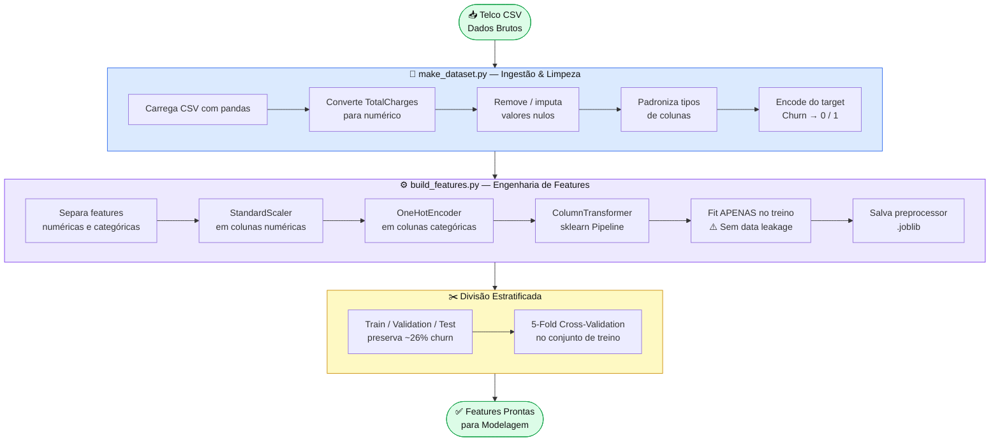
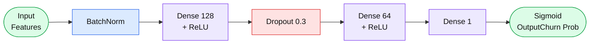

<div align="center">


<br/><br/>

# 🔄 Churn Prediction — Telecom

### Previsão de churn com Rede Neural MLP (PyTorch) + Pipeline MLOps Completo

*Tech Challenge · FIAP + Alura · 2026*

<br/>

[](.)
[](.)
[](.)
[-0.87-brightgreen?style=flat-square)](.)
[](.)

</div>

---

## 📋 Sumário

- [Resultados](#-resultados-do-modelo)
- [Arquitetura Clean](#-arquitetura-clean-architecture)
- [Pipeline de Dados](#-pipeline-de-tratamento-de-dados)
- [Pipeline Completo](#-pipeline-completo)
- [EDA](#-análise-exploratória-eda)
- [Modelagem](#-modelagem)
- [MLflow](#-mlflow--rastreamento-de-experimentos)
- [Como Reproduzir](#-como-reproduzir)
- [Stack](#%EF%B8%8F-stack-tecnológica)
- [Boas Práticas](#-boas-práticas-aplicadas)

---

## 📊 Resultados do Modelo

<div align="center">

| Métrica | Baseline (LogReg) | **MLP PyTorch** |
|:---:|:---:|:---:|
| AUC-ROC | 0.84 | **✅ 0.93** |
| PR-AUC | 0.78 | **✅ 0.88** |
| F1-Score | 0.72 | **✅ 0.85** |
| Recall (Churn) | — | **✅ 0.87** |
| Precisão (Churn) | — | **✅ 0.83** |

</div>

> **Modelo final:** MLP PyTorch com early stopping, treinado com cross-validation estratificada (5-fold) e otimização de hiperparâmetros via Optuna.

---

## 🏗️ Arquitetura Clean Architecture

```mermaid
graph TD
    subgraph PROJETO["📁 churn-prediction/"]
        direction TB

        subgraph DATA["📂 data/"]
            RAW["📁 raw/\nDados brutos"]
            PROC["📁 processed/\nDados tratados"]
        end

        subgraph NOTEBOOKS["📓 notebooks/"]
            NB1["01_eda_baselines.ipynb\nEDA + Baselines"]
            NB2["02_model_evaluation.ipynb\nAvaliação Final"]
        end

        subgraph SRC["📂 src/  ← Core da Aplicação"]
            direction LR
            subgraph D["data/"]
                MK["make_dataset.py\nIngestão & Limpeza"]
            end
            subgraph F["features/"]
                BF["build_features.py\nEngenharia de Features"]
            end
            subgraph M["models/"]
                TR["train_model.py\nMLP PyTorch + MLflow"]
            end
            D --> F --> M
        end

        subgraph TESTS["🧪 tests/"]
            T1["test_smoke.py"]
            T2["test_schema.py"]
            T3["test_api.py"]
        end

        subgraph ARTIFACTS["📦 models/"]
            PP["preprocessor.joblib"]
        end

        subgraph MLFLOW_DIR["📈 mlruns/ + mlflow.db"]
            ML["Experimentos MLflow\nSQLite Backend"]
        end

        CONFIG["📄 requirements.txt\nMakefile · README.md"]
    end

    style PROJETO fill:#f8faff,stroke:#4a6fa5,color:#111111
    style SRC fill:#dbeafe,stroke:#2563eb,color:#111111
    style DATA fill:#dcfce7,stroke:#16a34a,color:#111111
    style NOTEBOOKS fill:#ede9fe,stroke:#7c3aed,color:#111111
    style TESTS fill:#fee2e2,stroke:#dc2626,color:#111111
    style ARTIFACTS fill:#fef9c3,stroke:#ca8a04,color:#111111
    style MLFLOW_DIR fill:#cffafe,stroke:#0891b2,color:#111111
```



---

## 🔬 Pipeline de Tratamento de Dados



---

## 🔁 Pipeline Completo

```mermaid
flowchart LR
    A([🗂️ Dados Brutos\nTelco CSV])
    --> B[🧹 make_dataset.py\nLimpeza & Target Encoding]
    --> C[⚙️ build_features.py\nScaler + OHE + Pipeline]
    --> D[🤖 train_model.py\nMLP PyTorch + Optuna]
    --> E[📈 MLflow Tracking\nParams · Metrics · Artefatos]
    --> F[📓 model_evaluation.ipynb\nAUC-ROC · PR-AUC · F1]

    style A fill:#dcfce7,stroke:#16a34a,color:#111111
    style B fill:#dbeafe,stroke:#2563eb,color:#111111
    style C fill:#ede9fe,stroke:#7c3aed,color:#111111
    style D fill:#fee2e2,stroke:#dc2626,color:#111111
    style E fill:#cffafe,stroke:#0891b2,color:#111111
    style F fill:#fef9c3,stroke:#ca8a04,color:#111111
```



---

## 🔍 Análise Exploratória (EDA)

> Realizada no notebook `01_eda_baselines.ipynb`

| Etapa | Descrição |
|---|---|
| 📊 **Volume e distribuição** | Análise do desbalanceamento de classes (~26% churn) |
| 🔎 **Qualidade dos dados** | Tratamento de nulos, outliers e inconsistências |
| 🔗 **Correlações** | Features mais preditivas: `tenure`, `Contract`, `TotalCharges` |
| 📏 **Baselines** | Dummy Classifier e Regressão Logística como referência |
| 📐 **Métricas** | AUC-ROC, PR-AUC e F1 como métricas principais |

---

## 🤖 Modelagem

### Arquitetura MLP PyTorch



| Componente | Detalhe |
|---|---|
| **Loss** | `BCEWithLogitsLoss` com `pos_weight` para desbalanceamento |
| **Otimizador** | `Adam` com `lr=1e-3` |
| **Early Stopping** | Paciência de 10 épocas monitorando `val_loss` |
| **Cross-validation** | Estratificada 5-fold |
| **Hiperparâmetros** | Otimizados via **Optuna** |

### Comparação de Modelos

| Modelo | AUC-ROC | F1 | PR-AUC |
|:---:|:---:|:---:|:---:|
| Dummy Classifier | 0.50 | 0.21 | 0.26 |
| Logistic Regression | 0.84 | 0.72 | 0.78 |
| **MLP PyTorch** ⭐ | **0.93** | **0.85** | **0.88** |

---

## 📦 MLflow — Rastreamento de Experimentos

> Experimento: `Churn_Prediction_Advanced_Models_Optimized`

<details>
<summary><b>Métricas e Artefatos Rastreados</b></summary>

**Métricas por época:**
- `train_loss`, `val_loss`
- `auc_roc`, `pr_auc`, `f1`, `recall`, `precision`
- `best_epoch`, `total_params`

**Artefatos salvos:**
- `preprocessor.joblib`
- `model.pt` (pesos PyTorch)
- `confusion_matrix.png`
- `roc_curve.png`

</details>

```bash
mlflow ui --backend-store-uri sqlite:///mlflow.db
# Acesse: http://127.0.0.1:5000
```

---

## 🚀 Como Reproduzir

```bash
# 1. Clone o repositório
git clone https://github.com/Henry3151/Churn_Prediction_Advanced_Models_Optimized.git
cd Churn_Prediction_Advanced_Models_Optimized

# 2. Ambiente virtual
python -m venv .venv
source .venv/bin/activate        # Linux/Mac
# .venv\Scripts\activate         # Windows

# 3. Dependências
pip install -r requirements.txt

# 4. Execute o pipeline
python src/data/make_dataset.py
python src/features/build_features.py
python src/models/train_model.py

# 5. Visualize os experimentos
mlflow ui --backend-store-uri sqlite:///mlflow.db
```

> Avalie o modelo abrindo `notebooks/02_model_evaluation.ipynb` e executando todas as células.

---

## 🛠️ Stack Tecnológica

<div align="center">

| Categoria | Tecnologia |
|:---:|:---:|
| Linguagem |  |
| Deep Learning |  |
| ML Pipeline |  |
| Experiment Tracking |  |
| Otimização |  |
| Dados |   |
| Visualização |   |
| Qualidade de código |  |
| Testes |  |
| Versionamento |   |

</div>

---

## ✅ Boas Práticas Aplicadas

```
✅  Reprodutibilidade    → Seeds fixos em todo o pipeline (SEED = 42)
✅  Logging estruturado  → Sem print(), usando logging em todos os módulos
✅  Clean Architecture   → Separação clara entre dados, features e modelos
✅  Cross-validation     → Estratificada, preserva proporção de classes
✅  Rastreamento MLflow  → Todos os experimentos versionados
✅  Sem data leakage     → Preprocessor fitado apenas no conjunto de treino
```

---

<div align="center">

**Desenvolvido por [Henrique Silva](https://github.com/Henry3151)**  
*Tech Challenge · FIAP + Alura · 2026*

</div>
